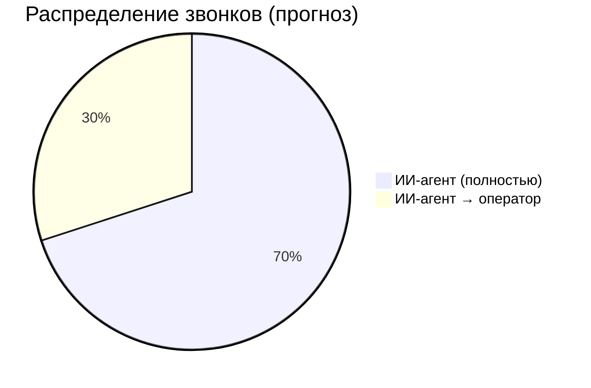
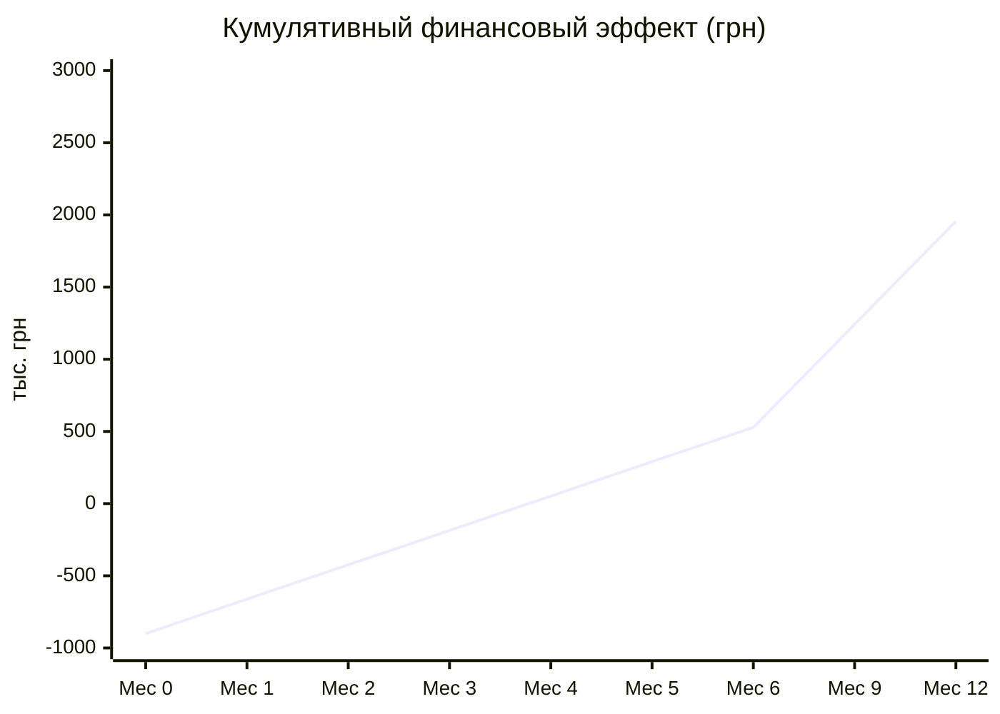

# Бизнес-кейс: ИИ-агент для колл-центра шинного магазина

## 1. Резюме

Внедрение ИИ-агента для автоматической обработки входящих звонков позволит сократить ежемесячные расходы на колл-центр с ~416 000 грн до ~178 000 грн (**экономия 57%**), одновременно повысив качество обслуживания и обеспечив круглосуточную доступность.

Стоимость разработки: **800 000 – 1 000 000 грн**. Срок окупаемости: **3–4 месяца**.

## 2. Текущая ситуация

### 2.1 Штат и расходы

| Показатель | Значение |
|------------|----------|
| Количество операторов | 10 |
| Средняя зарплата | 30 000 грн/мес |
| ФОТ (gross) | 300 000 грн/мес |
| ЕСВ (22%) | 66 000 грн/мес |
| Рабочие места, оборудование, связь | ~30 000 грн/мес |
| Обучение новых сотрудников, текучка | ~20 000 грн/мес |
| **Итого ежемесячно** | **~416 000 грн** |
| **Итого в год** | **~4 992 000 грн** |

### 2.2 Операционные показатели

| Показатель | Значение |
|------------|----------|
| Звонков в день | 200–500 |
| Средняя длительность звонка | 3–5 мин |
| Режим работы | По сменам (ограниченные часы) |
| Потери звонков в пиковые часы | До 30% |
| Время ожидания в очереди | 30–120 сек |
| Стоимость 1 звонка (оператор) | ~28–55 грн |

### 2.3 Проблемы текущей модели

- **Непостоянное качество** — зависит от оператора, настроения, загруженности
- **Ограниченные часы работы** — потеря клиентов в нерабочее время
- **Невозможность масштабирования** — в сезон (осень/весна) нужно нанимать временный персонал
- **Высокая текучка** — средний срок работы оператора 8–12 месяцев
- **Нет аналитики** — невозможно системно анализировать качество обслуживания

## 3. Предлагаемое решение

### 3.1 Модель работы

ИИ-агент принимает **все** входящие звонки. По статистике подобных решений, 65–75% обращений решаются автоматически. Оставшиеся 25–35% переключаются на живых операторов.

### 3.2 Штат после внедрения

| Роль | Количество | Зарплата | ФОТ |
|------|------------|----------|-----|
| Операторы (сложные случаи) | 3 | 30 000 грн | 90 000 грн |
| **Итого ФОТ** | | | **90 000 грн** |
| ЕСВ (22%) | | | 19 800 грн |
| **Итого с ЕСВ** | | | **109 800 грн** |

> 7 операторов высвобождаются. Часть можно переквалифицировать (контроль качества, администрирование бота).

## 4. Финансовый анализ

### 4.1 Стоимость разработки (единоразово)

| Статья | Сумма |
|--------|-------|
| Разработка MVP (фаза 1) | 300 000 – 400 000 грн |
| Фаза 2 — заказы | 150 000 – 200 000 грн |
| Фаза 3 — сервисы | 200 000 – 250 000 грн |
| Фаза 4 — аналитика | 150 000 – 200 000 грн |
| **Итого разработка** | **800 000 – 1 050 000 грн** |

### 4.2 Ежемесячные операционные расходы (с ИИ)

| Статья | Сумма | Комментарий |
|--------|-------|-------------|
| ФОТ 3 операторов + ЕСВ | 109 800 грн | Сложные случаи |
| Google STT | ~37 000 грн | ~$900, 500 зв/день |
| Google TTS | ~10 000 грн | ~$240 |
| Claude API | ~18 500 грн | ~$450 |
| Сервер (хостинг) | ~2 500 грн | ~$60 |
| **Итого** | **~178 000 грн** | |

### 4.3 Сравнение расходов

| Показатель | Без ИИ | С ИИ | Разница |
|------------|--------|------|---------|
| Ежемесячные расходы | 416 000 грн | 178 000 грн | **-238 000 грн (-57%)** |
| Годовые расходы | 4 992 000 грн | 2 136 000 грн | **-2 856 000 грн** |
| Стоимость 1 звонка | ~28–55 грн | ~12 грн | **-60–78%** |

### 4.4 Окупаемость

| Показатель | Значение |
|------------|----------|
| Инвестиция (разработка) | ~900 000 грн |
| Ежемесячная экономия | ~238 000 грн |
| **Срок окупаемости** | **~3.8 месяца** |
| ROI за 1 год | **217%** |
| ROI за 2 года | **535%** |

### 4.5 Потенциал дополнительной оптимизации (фаза 4)

| Оптимизация | Экономия/мес | Когда |
|-------------|-------------|-------|
| Self-hosted Whisper (замена Google STT) | ~30 000 грн | После 6 мес |
| Кэширование TTS (частые фразы) | ~3 000 грн | После 3 мес |
| Роутинг LLM (простые → Haiku) | ~9 000 грн | После 6 мес |
| **Итого доп. экономия** | **~42 000 грн/мес** | |
| **Расходы после оптимизации** | **~136 000 грн/мес** | |

## 5. Нефинансовые выгоды

### 5.1 Для клиентов

- **24/7 доступность** — бот работает всегда, включая ночь, выходные, праздники
- **Нулевое время ожидания** — ответ мгновенный, нет очереди
- **Стабильное качество** — каждый клиент получает одинаково вежливое обслуживание
- **Быстрый ответ** — бот находит информацию за секунды, а не минуты

### 5.2 Для бизнеса

- **Масштабируемость** — в сезон не нужно нанимать временный персонал
- **Аналитика** — каждый звонок записан, транскрибирован, оценён
- **Данные для маркетинга** — понимание что клиенты ищут, какие бренды популярны
- **Сокращение потерянных звонков** — 0% потерь vs 30% в пиковые часы
- **Увеличение конверсии** — бот всегда предлагает оформить заказ

### 5.3 Оценка влияния на продажи

Консервативная оценка:
- Сокращение потерянных звонков: +15% обработанных обращений
- Увеличение конверсии (бот всегда предлагает покупку): +5–10%
- При среднем чеке ~10 000 грн и 300 заказах/мес: **+150 000 – 300 000 грн выручки/мес**

## 6. Риски

| Риск | Вероятность | Влияние | Митигация |
|------|-------------|---------|-----------|
| Клиенты негативно воспримут бота | Средняя | Среднее | Мгновенное переключение на оператора; пилот на 10% трафика |
| Ошибки в оформлении заказов | Средняя | Высокое | Обязательное голосовое подтверждение; лимит суммы заказа |
| Рост тарифов API | Низкая | Среднее | Миграция на self-hosted модели (Whisper, open-source LLM) |
| Простой внешних сервисов | Низкая | Высокое | Автопереключение на очередь операторов |
| Плохое распознавание диалектов | Низкая | Среднее | Дообучение модели; fallback на оператора |

## 7. Критерии успеха

| KPI | Цель (MVP) | Цель (6 мес) |
|-----|------------|--------------|
| % звонков, обработанных без оператора | >50% | >70% |
| Среднее время ответа | <3 сек | <2 сек |
| Потерянные звонки | <5% | 0% |
| Оценка качества диалогов | >0.7 | >0.85 |
| Стоимость обработки 1 звонка | <20 грн | <12 грн |

## 8. Рекомендация

**Рекомендуем утвердить проект.** При инвестиции ~900 000 грн проект окупается за 4 месяца и генерирует ~2.8 млн грн экономии ежегодно, с потенциалом дополнительного роста выручки через увеличение конверсии и сокращение потерянных обращений.

Начало с MVP (6 недель) позволяет быстро валидировать гипотезу при минимальных рисках.
