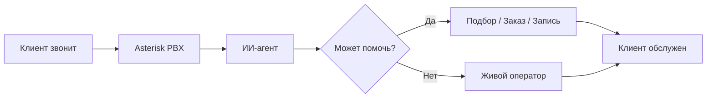
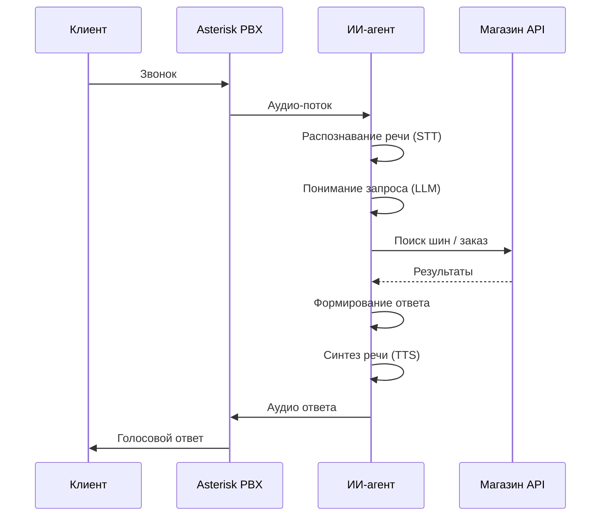
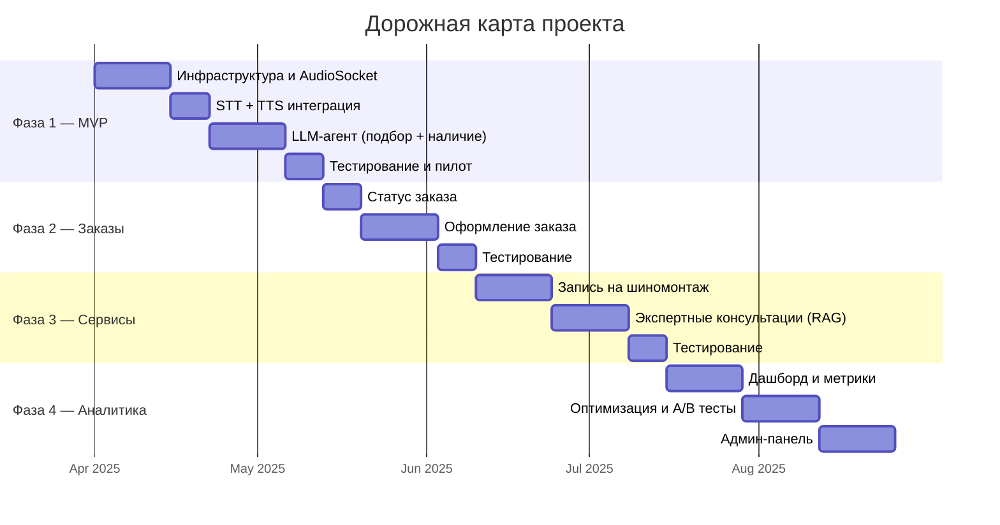

# Call Center AI — Презентация проекта

## Слайд 1: Проблема

### Колл-центр шинного интернет-магазина сегодня

- **10 операторов** обрабатывают 200–500 звонков в день
- Фонд оплаты труда: **300 000 грн/мес** (с ЕСВ — **366 000 грн**)
- Операторы работают по сменам, но звонки приходят **24/7**
- Типовые вопросы повторяются: подбор шин, наличие, статус заказа
- Текучка кадров → постоянные затраты на обучение
- Качество обслуживания зависит от конкретного оператора
- В пиковые сезоны (осень/весна) — **потеря до 30% звонков** из-за перегрузки

---

## Слайд 2: Решение

### ИИ-агент для обработки телефонных звонков

**Что умеет ИИ-агент:**
- Ведёт диалог на **украинском языке** естественным голосом
- Подбирает шины по автомобилю, размеру, сезону, бюджету
- Проверяет наличие и цены в реальном времени
- Оформляет заказы и сообщает статус доставки
- Записывает на шиномонтаж
- Даёт экспертные консультации (сравнение брендов, рекомендации)
- Переключает на живого оператора, если не может помочь

---

## Слайд 3: Ключевые преимущества

| Параметр | Сейчас (операторы) | С ИИ-агентом |
|----------|-------------------|--------------|
| Режим работы | По сменам (8–20) | **24/7/365** |
| Одновременные звонки | 10 | **Неограниченно** |
| Время ответа | 30–120 сек (очередь) | **< 2 сек** |
| Качество | Зависит от оператора | **Стабильное** |
| Масштабирование | Нанять + обучить (2–4 нед) | **Мгновенно** |
| Ежемесячные расходы | ~416 000 грн | **~178 000 грн** |
| Потерянные звонки в пик | До 30% | **0%** |

---

## Слайд 4: Как это работает

**Технологии:**
- **Asterisk 20** — уже используется, без замены
- **Google Speech-to-Text** — лучшее распознавание украинского
- **Claude AI (Anthropic)** — понимание контекста и ведение диалога
- **Google Text-to-Speech** — естественный украинский голос

---

## Слайд 5: Финансовая модель

### Текущие расходы (ежемесячно)

| Статья | Сумма |
|--------|-------|
| Зарплаты 10 операторов | 300 000 грн |
| ЕСВ (22%) | 66 000 грн |
| Рабочие места, оборудование | ~30 000 грн |
| Обучение, текучка | ~20 000 грн |
| **Итого** | **~416 000 грн** |

### Расходы с ИИ-агентом (ежемесячно)

| Статья | Сумма |
|--------|-------|
| Зарплаты 3 операторов (сложные случаи) | 90 000 грн |
| ЕСВ (22%) | 19 800 грн |
| Google STT (распознавание речи) | ~37 000 грн |
| Google TTS (синтез речи) | ~10 000 грн |
| Claude API (ИИ-модель) | ~18 500 грн |
| Сервер (хостинг) | ~2 500 грн |
| **Итого** | **~178 000 грн** |

### Экономия

| Показатель | Значение |
|------------|----------|
| Ежемесячная экономия | **~238 000 грн** |
| Годовая экономия | **~2 856 000 грн** |
| Стоимость разработки | ~800 000 – 1 000 000 грн |
| **Срок окупаемости** | **3–4 месяца** |

---

## Слайд 6: Дорожная карта

| Фаза | Что даёт | Срок |
|------|----------|------|
| **Фаза 1 — MVP** | Подбор шин + наличие + переключение на оператора | 6 недель |
| **Фаза 2 — Заказы** | Статус заказа + оформление по телефону | +4 недели |
| **Фаза 3 — Сервисы** | Шиномонтаж + консультации | +5 недель |
| **Фаза 4 — Аналитика** | Дашборд + оптимизация + админка | +6 недель |
| **Итого до полной версии** | | **~21 неделя (~5 мес)** |

> MVP запускается через 6 недель — уже начинает экономить деньги.

---

## Слайд 7: Риски и митигация

| Риск | Вероятность | Митигация |
|------|-------------|-----------|
| Плохое распознавание украинского | Низкая | Google STT — лидер по качеству UA; fallback на Whisper |
| Клиенты не хотят говорить с ботом | Средняя | Мгновенное переключение на оператора по запросу |
| Ошибки при оформлении заказов | Средняя | Обязательное голосовое подтверждение перед оформлением |
| Рост расходов на API | Низкая | Миграция на self-hosted Whisper в фазе 4 (экономия 80% на STT) |
| Сбой внешних сервисов | Низкая | Автоматическое переключение на очередь операторов |

---

## Слайд 8: Конкурентные преимущества

1. **Использует существующую телефонию** — Asterisk уже есть, замена не нужна
2. **Украинский язык** — полная поддержка, не суржик
3. **Интеграция с вашим магазином** — реальные данные о товарах, ценах, наличии
4. **Масштабируемость** — 10 звонков или 1000 — одна и та же система
5. **Обучаемость** — база знаний обновляется, промпты оптимизируются по логам
6. **Прозрачность** — каждый звонок записан, транскрибирован, оценён

---

## Слайд 9: Следующие шаги

1. Утверждение бюджета и сроков
2. Настройка Google Cloud и Anthropic API
3. Разработка MVP (фаза 1) — **6 недель**
4. Пилотный запуск на 10% трафика
5. Анализ результатов, доработка
6. Полный запуск
