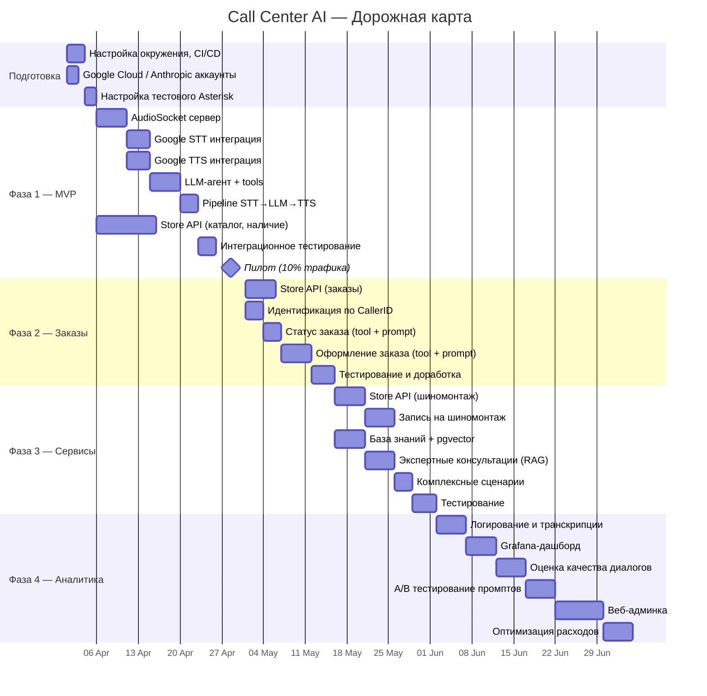
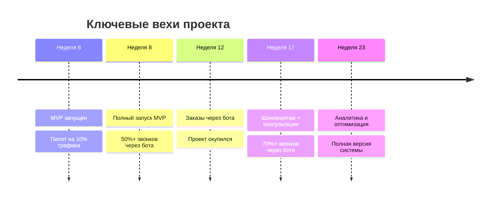

# Дорожная карта проекта

## Общий таймлайн

## Фазы детально

### Фаза 1 — MVP (6 недель)

**Цель:** бот принимает звонки, подбирает шины, проверяет наличие, переключает на оператора.

**Milestone:** пилотный запуск на 10% входящих звонков.

| Задача | Срок | Зависимости |
|--------|------|-------------|
| Настройка инфраструктуры (Docker, CI/CD, staging) | 3 дня | — |
| Google Cloud и Anthropic API — аккаунты, ключи | 2 дня | — |
| Asterisk AudioSocket — dialplan + тестовый канал | 2 дня | Инфраструктура |
| AudioSocket TCP-сервер (Python) | 5 дней | Asterisk |
| Google STT streaming интеграция | 4 дня | AudioSocket |
| Google TTS интеграция | 4 дня | AudioSocket |
| LLM-агент (Claude) + tools (search, availability) | 5 дней | STT |
| Pipeline: STT → LLM → TTS (barge-in, таймауты) | 3 дня | Все компоненты |
| Store API: каталог, поиск, наличие, подбор по авто | 10 дней | — (параллельно) |
| Интеграционное тестирование | 3 дня | Pipeline + API |
| Пилотный запуск (10% трафика) | 5 дней | Всё |

**Результат:** экономия начинается сразу — бот обрабатывает 50%+ простых запросов.

---

### Фаза 2 — Заказы (+4 недели)

**Цель:** бот проверяет статус заказа и проводит полный цикл оформления.

**Milestone:** первый заказ, оформленный ботом без участия оператора.

| Задача | Срок | Зависимости |
|--------|------|-------------|
| Store API: заказы (CRUD, статусы, доставка) | 5 дней | — |
| Идентификация клиента по CallerID (ARI) | 3 дня | Фаза 1 |
| Tool + prompt: статус заказа | 3 дня | API |
| Tool + prompt: оформление заказа (черновик → подтверждение) | 5 дней | API |
| Безопасность: подтверждение, лимиты, отмена | 2 дня | Оформление |
| Тестирование и доработка | 4 дня | Всё |

**Результат:** 70%+ звонков о статусе обрабатываются ботом. Заказы оформляются без оператора.

---

### Фаза 3 — Сервисы (+5 недель)

**Цель:** запись на шиномонтаж и экспертные консультации.

**Milestone:** первая запись на шиномонтаж через бота; RAG-консультация с использованием базы знаний.

| Задача | Срок | Зависимости |
|--------|------|-------------|
| Store API: шиномонтаж (точки, слоты, бронирование) | 5 дней | — |
| Tool + prompt: запись на шиномонтаж | 5 дней | API |
| PostgreSQL + pgvector: хранилище базы знаний | 3 дней | — |
| Наполнение базы знаний (бренды, FAQ, гайды) | 3 дня | pgvector |
| Tool + prompt: экспертная консультация (RAG) | 5 дней | База знаний |
| Комплексные сценарии (подбор → заказ → монтаж) | 3 дня | Всё |
| Тестирование | 4 дня | Всё |

**Результат:** полный цикл обслуживания через бота. 70%+ звонков без оператора.

---

### Фаза 4 — Аналитика (+6 недель)

**Цель:** понимать, как работает бот, и системно улучшать качество.

**Milestone:** дашборд с метриками в реальном времени; первый A/B тест промптов.

| Задача | Срок | Зависимости |
|--------|------|-------------|
| Структурированное логирование звонков | 5 дней | — |
| Grafana + Prometheus — дашборд реального времени | 5 дней | Логирование |
| Автоматическая оценка качества (LLM-ревью) | 5 дней | Логирование |
| A/B тестирование промптов | 5 дней | Оценка качества |
| Веб-админка (журнал, промпты, база знаний) | 8 дней | Всё |
| Оптимизация расходов (кэш TTS, роутинг LLM) | 5 дней | Аналитика |

**Результат:** полная прозрачность работы бота. Инструменты для непрерывного улучшения.

---

## Ключевые вехи

## Команда

| Роль | Количество | Фазы |
|------|------------|------|
| Python-разработчик (бэкенд + AI) | 1–2 | Все фазы |
| Разработчик Store API | 1 | Все фазы |
| DevOps / Asterisk-инженер | 0.5 | Фазы 1, 4 |
| QA / тестировщик | 0.5 | Все фазы |
| Менеджер проекта | 0.5 | Все фазы |

## Критерии перехода между фазами

| Переход | Условие |
|---------|---------|
| Подготовка → Фаза 1 | Инфраструктура готова, API-ключи получены |
| Фаза 1 → Фаза 2 | MVP стабильно работает 1 неделю, >50% звонков обработано |
| Фаза 2 → Фаза 3 | Заказы оформляются корректно, нет критических багов |
| Фаза 3 → Фаза 4 | Все сценарии работают, >70% звонков без оператора |
