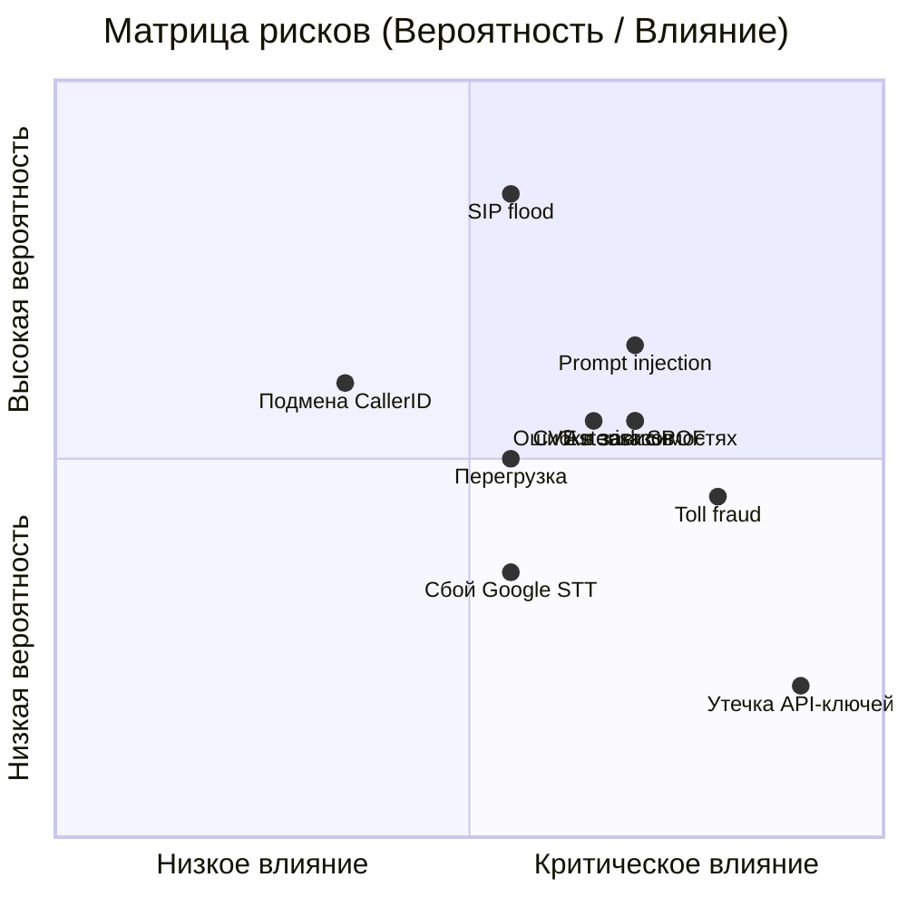

# Матрица рисков

## Шкала оценки

**Вероятность:**
- Низкая (1) — маловероятно, требует значительных усилий
- Средняя (2) — возможно при определённых условиях
- Высокая (3) — вероятно, легко осуществимо

**Влияние:**
- Низкое (1) — незначительные последствия, быстрое восстановление
- Среднее (2) — заметные потери, восстановление за часы
- Высокое (3) — значительные потери, восстановление за дни
- Критическое (4) — катастрофические последствия

**Уровень риска = Вероятность x Влияние:**
- 1–2: Приемлемый (мониторинг)
- 3–4: Умеренный (план митигации)
- 6–8: Высокий (активная митигация, приоритет)
- 9–12: Критический (немедленные действия)

## Матрица

## Детальная таблица рисков

### Технические риски

| # | Риск | Вероятность | Влияние | Уровень | Митигация | Статус |
|---|------|-------------|---------|---------|-----------|--------|
| T1 | SIP-флуд / DDoS на Asterisk | Высокая (3) | Высокое (3) | **9** | fail2ban, SIP firewall, rate limiting, GeoIP blocking | Требуется |
| T2 | Prompt injection через речь | Средняя (2) | Высокое (3) | **6** | Strict system prompt, tool call validation, rate limits, суммовые лимиты | Требуется |
| T3 | Сбой Google STT/TTS | Низкая (1) | Высокое (3) | **3** | Автопереключение на оператора; fallback провайдер | План |
| T4 | Сбой Claude API | Низкая (1) | Высокое (3) | **3** | 1 retry → переключение на оператора | План |
| T5 | Перегрузка (больше звонков чем ресурсов) | Средняя (2) | Среднее (2) | **4** | Max concurrent sessions, queue, горизонтальное масштабирование | План |
| T6 | Потеря данных PostgreSQL | Низкая (1) | Критическое (4) | **4** | Ежедневные бэкапы, реплика, тестирование восстановления | Требуется |
| T7 | Утечка API-ключей | Низкая (1) | Критическое (4) | **4** | Env variables, docker secrets, ротация, мониторинг использования | Требуется |
| T8 | Некорректная работа AudioSocket | Средняя (2) | Среднее (2) | **4** | Unit-тесты протокола, мониторинг, автоперезапуск | В работе |
| T9 | Уязвимости в зависимостях (CVE) | Средняя (2) | Высокое (3) | **6** | pip-audit в CI/CD, Dependabot, политика обновления | Требуется |
| T10 | Asterisk SPOF (единая точка отказа) | Средняя (2) | Высокое (3) | **6** | Мониторинг + алерт (MVP); SIP failover (фаза 3+) | План |

### Бизнес-риски

| # | Риск | Вероятность | Влияние | Уровень | Митигация | Статус |
|---|------|-------------|---------|---------|-----------|--------|
| B1 | Клиенты не хотят общаться с ботом | Средняя (2) | Высокое (3) | **6** | Мгновенное переключение на оператора; пилот 10%; сбор обратной связи | План |
| B2 | Ошибки при оформлении заказов | Средняя (2) | Высокое (3) | **6** | Голосовое подтверждение; лимит суммы; отмена в любой момент | Требуется |
| B3 | Рост тарифов API (Google, Anthropic) | Низкая (1) | Среднее (2) | **2** | Абстракции для замены провайдера; self-hosted Whisper в фазе 4 | Мониторинг |
| B4 | Низкое качество распознавания украинского | Низкая (1) | Высокое (3) | **3** | Google STT — лидер по качеству UA; альтернатива — Whisper large-v3 | Мониторинг |
| B5 | Подмена CallerID → мошенничество с заказами | Средняя (2) | Высокое (3) | **6** | Не полагаться только на CallerID; доп. верификация для заказов; суммовые лимиты | Требуется |
| B6 | Toll fraud через Asterisk | Средняя (2) | Критическое (4) | **8** | Strong SIP passwords, IP whitelist, мониторинг аномальных звонков, spending alerts | Требуется |

### Регуляторные риски

| # | Риск | Вероятность | Влияние | Уровень | Митигация | Статус |
|---|------|-------------|---------|---------|-----------|--------|
| R1 | Нарушение Закону "Про захист персональних даних" | Низкая (1) | Высокое (3) | **3** | Минимизация PII, уведомление о записи, право на удаление | План |
| R2 | Жалобы клиентов на автоматическую обработку | Средняя (2) | Среднее (2) | **4** | Право на отказ (переключение на оператора), прозрачность | План |
| R3 | Утечка персональных данных | Низкая (1) | Критическое (4) | **4** | Шифрование, маскирование, аудит доступа, процедура breach | Требуется |

## План действий (по приоритету)

### Критические (уровень 8+)

| # | Риск | Действие | Срок |
|---|------|----------|------|
| B6 | Toll fraud | Настройка SIP security, IP whitelist, spending alerts | До запуска MVP |

### Высокие (уровень 6)

| # | Риск | Действие | Срок |
|---|------|----------|------|
| T1 | SIP DDoS | fail2ban + SIP firewall | До запуска MVP |
| T2 | Prompt injection | Strict prompt + validation + лимиты | До запуска MVP |
| B1 | Клиенты не хотят бота | Пилот 10% + сбор обратной связи | При запуске MVP |
| B2 | Ошибки заказов | Подтверждение + лимиты + отмена | До запуска Фазы 2 |
| B5 | Подмена CallerID | Доп. верификация для заказов | До запуска Фазы 2 |
| T9 | Уязвимости зависимостей | pip-audit в CI/CD + Dependabot | До запуска MVP |
| T10 | Asterisk SPOF | Мониторинг + алерт; SIP failover | Мониторинг: Фаза 1; Failover: Фаза 3 |

### Умеренные (уровень 3–4)

| # | Риск | Действие | Срок |
|---|------|----------|------|
| T5 | Перегрузка | Настройка max sessions + мониторинг | Фаза 1 |
| T6 | Потеря данных | Настройка бэкапов + тест восстановления | Фаза 1 |
| T7 | Утечка ключей | Docker secrets + ротация | Фаза 1 |
| R3 | Утечка PII | Маскирование + аудит | Фаза 2 |

## Пересмотр

Матрица рисков пересматривается:
- При запуске каждой новой фазы
- После каждого инцидента
- Ежеквартально в плановом порядке
