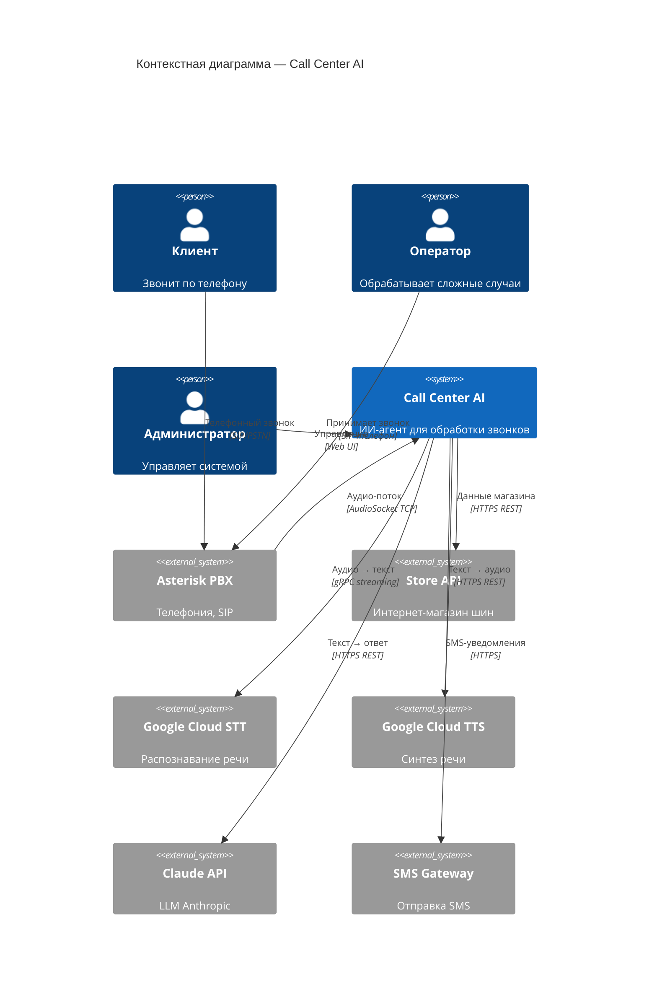
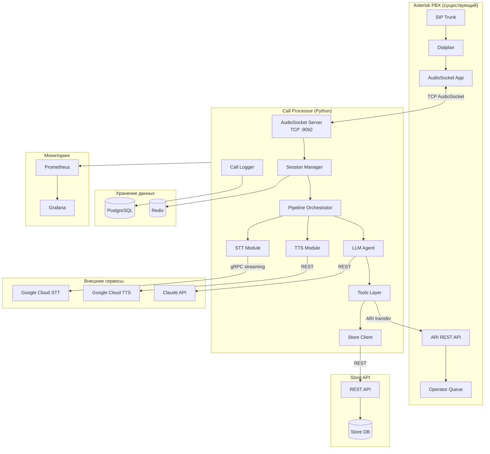
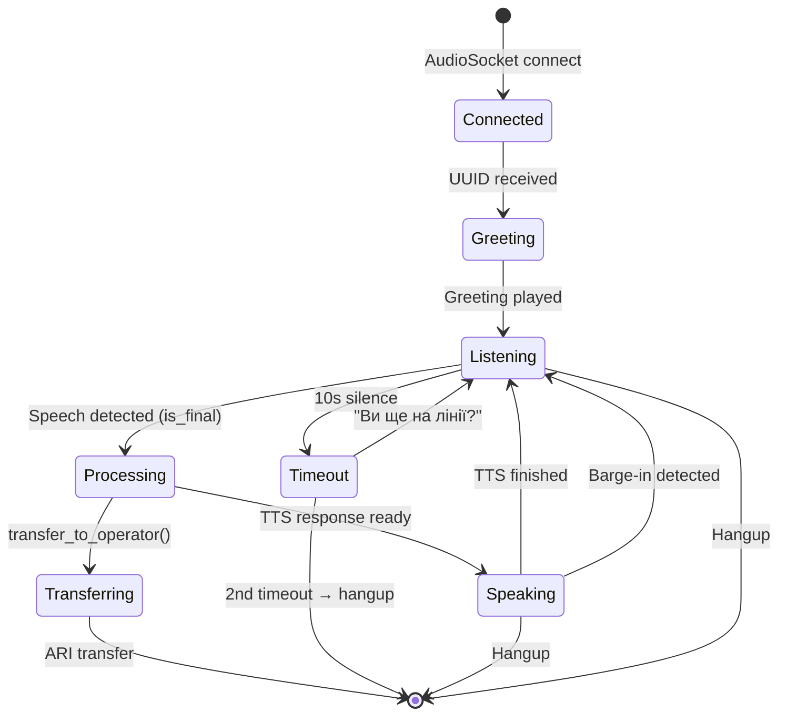
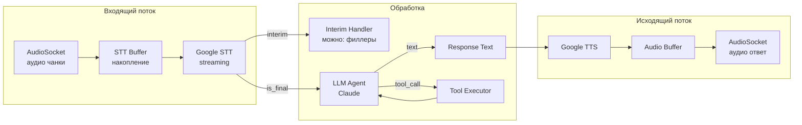
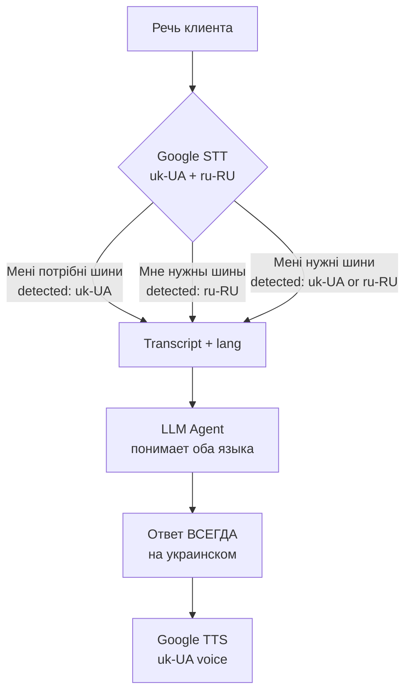
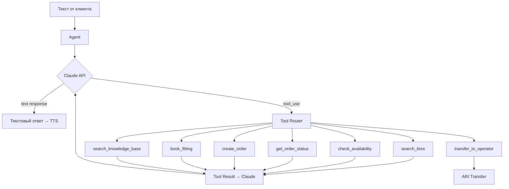

# Архитектурный обзор (SAD)

## 1. Контекст системы



## 2. Компоненты системы



## 3. Описание компонентов

### 3.1 AudioSocket Server

| Параметр | Значение |
|----------|----------|
| Протокол | TCP |
| Порт | 9092 |
| Формат аудио | 16kHz, 16-bit, signed linear PCM, little-endian |
| Фреймворк | asyncio (Python) |

**Ответственность:**
- Приём TCP-соединений от Asterisk AudioSocket
- Парсинг протокола AudioSocket (type + length + payload)
- Двунаправленная передача аудио (чтение от клиента, запись ответов)
- Создание сессии для каждого звонка

**Протокол AudioSocket:**

```
┌──────────┬───────────────┬────────────────┐
│ Type (1B)│ Length (2B BE) │ Payload (N B)  │
└──────────┴───────────────┴────────────────┘

Type 0x01 = UUID (channel ID)
Type 0x10 = Audio data
Type 0x00 = Hangup
Type 0xFF = Error
```

### 3.2 Session Manager

**Ответственность:**
- Управление жизненным циклом сессии звонка
- Хранение контекста диалога (история сообщений)
- CallerID через Asterisk ARI
- Таймауты (тишина, максимальная длительность)
- Graceful shutdown при hangup

**Хранение сессий в Redis:**

```python
# Ключ сессии: call_session:{uuid}
# TTL: 30 минут (максимальная длительность звонка + запас)
await redis.setex(
    f"call_session:{channel_uuid}",
    ttl=1800,  # 30 мин
    value=session.serialize(),
)
```

TTL гарантирует автоматическую очистку сессий при аварийных обрывах (hangup не получен, процесс упал). Без TTL — утечка памяти Redis.

**Состояния сессии:**



### 3.3 Pipeline Orchestrator

**Ответственность:**
- Координация потока: Audio → STT → LLM → TTS → Audio
- Управление barge-in (прерывание TTS при речи клиента)
- Буферизация аудио
- Мониторинг задержек

**Архитектура потоков данных:**



### 3.4 STT Module

**Ответственность:**
- Streaming-отправка аудио в Google Cloud Speech-to-Text
- Обработка interim и final результатов
- VAD (Voice Activity Detection) — определение конца фразы
- Управление сессией распознавания (restart каждые ~5 мин — лимит Google)
- **Мультиязычное распознавание** (украинский + русский)

**Мультиязычная стратегия:**

Клиенты в Украине говорят на украинском, русском и суржике (mix). Система должна понимать все варианты.



**Конфигурация Google STT:**

```python
config = cloud_speech.RecognitionConfig(
    language_code="uk-UA",                    # основной язык
    alternative_language_codes=["ru-RU"],     # альтернативный
    # Google STT автоматически определяет язык каждой фразы
    # и возвращает detected language_code в результате
)
```

**Поведение при разных языках ввода:**

| Клиент говорит | STT detected | LLM понимает | Бот отвечает |
|----------------|-------------|-------------|-------------|
| Чисто украинский | uk-UA | Да | Украинский |
| Чисто русский | ru-RU | Да | Украинский |
| Суржик | uk-UA или ru-RU | Да | Украинский |
| Code-switching (mix в одном предложении) | uk-UA | Да (частично) | Украинский |

**Важно:** бот ВСЕГДА отвечает по-украински. Это бизнес-решение (язык магазина) и техническое (TTS настроен на uk-UA голос).

**Метрики языка:**
- `detected_language` логируется для каждого transcript
- Аналитика: % звонков на украинском / русском / суржике
- Если доля русского > 40% — рассмотреть ru-RU TTS как опцию

**Ограничения:**
- `alternative_language_codes` немного увеличивает задержку STT (~50-100ms)
- Суржик с сильным code-switching может распознаваться с пониженной accuracy
- Whisper (future) лучше справляется с code-switching, чем Google STT

**Интерфейс:**

```python
class STTEngine(Protocol):
    async def start_stream(self, config: STTConfig) -> None: ...
    async def feed_audio(self, chunk: bytes) -> None: ...
    async def get_transcripts(self) -> AsyncIterator[Transcript]: ...
    async def stop_stream(self) -> None: ...

@dataclass
class Transcript:
    text: str
    is_final: bool
    confidence: float
    language: str       # "uk-UA" или "ru-RU" — detected language
```

### 3.5 TTS Module

**Ответственность:**
- Синтез украинской речи
- Конвертация в формат AudioSocket (16kHz PCM)
- Кэширование частых фраз
- Streaming для длинных ответов (по предложениям)

**Интерфейс:**

```python
class TTSEngine(Protocol):
    async def synthesize(self, text: str) -> bytes: ...
    async def synthesize_stream(self, text: str) -> AsyncIterator[bytes]: ...

class CachedTTSEngine:
    """Обёртка с кэшированием частых фраз."""
    cache: dict[str, bytes]
```

### 3.6 LLM Agent

**Ответственность:**
- Ведение диалога с использованием Claude API
- Tool calling (search_tires, check_availability, etc.)
- Управление контекстом (system prompt + history)
- Определение намерения клиента

**Архитектура:**



### 3.7 Store Client

**Ответственность:**
- HTTP-клиент для Store API
- Retry с exponential backoff
- Circuit breaker (если API недоступен → сообщить клиенту)
- Маппинг ответов API в формат для LLM tools

**Circuit Breaker (aiobreaker):**

```python
from aiobreaker import CircuitBreaker

store_breaker = CircuitBreaker(
    fail_max=5,           # 5 ошибок подряд → open
    timeout_duration=30,  # через 30 сек → half-open (пробный запрос)
)

@store_breaker
async def search_tires(params: dict) -> dict:
    async with session.get(f"{STORE_URL}/tires/search", params=params) as resp:
        resp.raise_for_status()
        return await resp.json()
```

Состояния: **Closed** (работает) → **Open** (5+ ошибок, все запросы отклоняются) → **Half-Open** (пробный запрос через 30 сек) → Closed.

При Open-состоянии агент получает tool result с ошибкой и сообщает клиенту о временных проблемах.

### 3.8 Call Logger

**Ответственность:**
- Запись каждого turn (реплики) в PostgreSQL
- Метрики задержек (STT, LLM, TTS)
- Стоимость звонка (по потреблению API)
- Асинхронная запись (не блокирует основной поток)

## 4. Интеграция с Asterisk

### 4.1 Dialplan

```
[incoming]
; Все входящие звонки → ИИ-агент
exten => _X.,1,NoOp(AI Call Center: ${CALLERID(num)})
 same => n,Answer()
 same => n,Set(CHANNEL(audioreadformat)=slin16)
 same => n,Set(CHANNEL(audiowriteformat)=slin16)
 same => n,AudioSocket(${UNIQUE_ID},127.0.0.1:9092)
 same => n,Hangup()

[transfer-to-operator]
; Переключение на оператора
exten => _X.,1,NoOp(Transfer to operator: ${CALLERID(num)})
 same => n,Queue(operators,t,,,120)
 same => n,VoiceMail(operator@default)
 same => n,Hangup()
```

### 4.2 ARI (Asterisk REST Interface)

Используется для:
- Получения CallerID по UUID канала
- Переключения звонка на очередь операторов
- Мониторинга состояния каналов

```
ARI URL: http://localhost:8088/ari
Auth: Basic (ari_user / ari_password)
```

## 5. Модель данных

Подробная ERD: [data-model.md](./data-model.md)

## 6. Принципы проектирования

1. **Абстракции для внешних сервисов** — STT, TTS, LLM подключаются через интерфейсы. Замена Google STT на Whisper не требует изменения pipeline.

2. **Graceful degradation** — при сбое внешнего сервиса звонок переключается на оператора, а не обрывается.

3. **Async everywhere** — все I/O операции асинхронные. Один процесс обрабатывает множество звонков.

4. **Stateless Call Processor** — состояние сессии в Redis (с TTL). Позволяет горизонтальное масштабирование.

5. **Observability** — каждый компонент экспортирует метрики в Prometheus. Каждый звонок логируется полностью.

## 7. Масштабирование

| Нагрузка | Конфигурация |
|----------|-------------|
| До 50 одновременных звонков | 1 инстанс Call Processor, 4 vCPU, 8GB RAM |
| 50–200 одновременных | 2–4 инстанса за load balancer, Asterisk распределяет по round-robin |
| 200+ одновременных | Кластер + dedicated GPU для self-hosted Whisper |

## 8. Технологические решения и обоснования

| Решение | Альтернативы | Почему выбрано |
|---------|-------------|----------------|
| Python | Node.js, Go, Rust | Лучшая экосистема для AI (SDK Google, Anthropic). Async для I/O-bound задач. |
| AudioSocket | ARI + ExternalMedia, AGI | Простейший способ получить raw audio. Нативная поддержка в Asterisk 20. |
| Google STT | Azure, Whisper API, Deepgram | Лучшее качество украинского. Streaming API. Низкая задержка. |
| Claude (Anthropic) | GPT-4o, Gemini | Лучший tool calling. Отличный украинский. Большой контекст. |
| Google TTS | Azure TTS, ElevenLabs, Piper (open-source) | Хорошие украинские голоса. Приемлемая стоимость. Open-source альтернативы (Piper) пока не дают достаточного качества для UA — пересмотреть через 6–12 мес. |
| PostgreSQL | MySQL, MongoDB | Стандарт. pgvector для RAG. JSONB для логов. |
| Redis | Memcached | Pub/sub для событий. Хранение сессий. Celery broker. |
