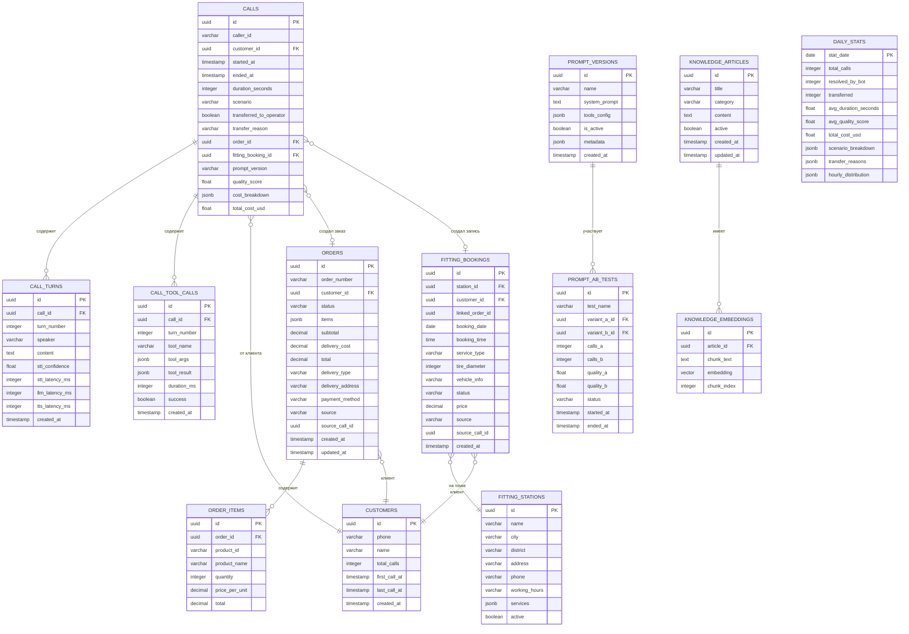

# Схема данных (ERD)

## Диаграмма



## Описание таблиц

### calls

Основная таблица — запись о каждом звонке.

| Поле | Тип | Описание |
|------|-----|----------|
| `id` | UUID | Первичный ключ (совпадает с Asterisk channel UUID) |
| `caller_id` | VARCHAR(20) | Номер телефона звонящего |
| `customer_id` | UUID | Ссылка на клиента (если идентифицирован) |
| `started_at` | TIMESTAMP | Время начала звонка |
| `ended_at` | TIMESTAMP | Время окончания |
| `duration_seconds` | INTEGER | Длительность в секундах |
| `scenario` | VARCHAR(50) | Тип сценария (tire_search, order_status, ...) |
| `transferred_to_operator` | BOOLEAN | Был ли переключён на оператора |
| `transfer_reason` | VARCHAR(50) | Причина переключения |
| `order_id` | UUID | Созданный заказ (если есть) |
| `fitting_booking_id` | UUID | Созданная запись на монтаж |
| `prompt_version` | VARCHAR(50) | Версия промпта (для A/B тестов) |
| `quality_score` | FLOAT | Оценка качества (0–1) |
| `cost_breakdown` | JSONB | Детализация расходов {stt, llm, tts} |
| `total_cost_usd` | FLOAT | Общая стоимость в USD |

### call_turns

Каждая реплика в диалоге.

| Поле | Тип | Описание |
|------|-----|----------|
| `speaker` | VARCHAR(10) | `customer` или `bot` |
| `content` | TEXT | Текст реплики |
| `stt_confidence` | FLOAT | Уверенность STT (для клиента) |
| `stt_latency_ms` | INTEGER | Задержка распознавания |
| `llm_latency_ms` | INTEGER | Задержка LLM (для бота) |
| `tts_latency_ms` | INTEGER | Задержка синтеза (для бота) |

### call_tool_calls

Все вызовы инструментов агента.

| Поле | Тип | Описание |
|------|-----|----------|
| `tool_name` | VARCHAR(50) | Имя инструмента (search_tires, ...) |
| `tool_args` | JSONB | Аргументы вызова |
| `tool_result` | JSONB | Результат |
| `duration_ms` | INTEGER | Время выполнения |
| `success` | BOOLEAN | Успешно ли выполнен |

### knowledge_embeddings

Векторное хранилище для RAG (pgvector).

| Поле | Тип | Описание |
|------|-----|----------|
| `embedding` | VECTOR(1536) | Вектор (OpenAI text-embedding-3-small или аналог) |
| `chunk_text` | TEXT | Текстовый фрагмент |
| `chunk_index` | INTEGER | Порядковый номер фрагмента в статье |

## Индексы

```sql
-- Поиск звонков по клиенту
CREATE INDEX idx_calls_caller_id ON calls(caller_id);
CREATE INDEX idx_calls_customer_id ON calls(customer_id);

-- Аналитика по дате
CREATE INDEX idx_calls_started_at ON calls(started_at);

-- Поиск реплик по звонку
CREATE INDEX idx_call_turns_call_id ON call_turns(call_id);

-- Векторный поиск
CREATE INDEX idx_knowledge_embeddings_vector
    ON knowledge_embeddings USING ivfflat (embedding vector_cosine_ops);

-- Поиск клиента по телефону
CREATE UNIQUE INDEX idx_customers_phone ON customers(phone);
```

## Партиционирование

Таблицы `calls`, `call_turns` и `call_tool_calls` растут линейно с количеством звонков. При 500 зв/день × 30 дней = 15,000 записей/мес в `calls`, и до 150,000/мес в `call_turns`. Для эффективной аналитики и очистки рекомендуется партиционирование по дате.

### Стратегия

```sql
-- Партиционирование таблицы calls по месяцам
CREATE TABLE calls (
    id UUID NOT NULL,
    caller_id VARCHAR(20),
    customer_id UUID,
    started_at TIMESTAMP NOT NULL,
    ended_at TIMESTAMP,
    duration_seconds INTEGER,
    scenario VARCHAR(50),
    transferred_to_operator BOOLEAN DEFAULT FALSE,
    transfer_reason VARCHAR(50),
    order_id UUID,
    fitting_booking_id UUID,
    prompt_version VARCHAR(50),
    quality_score FLOAT,
    cost_breakdown JSONB,
    total_cost_usd FLOAT
) PARTITION BY RANGE (started_at);

-- Создание партиций (автоматизировать через pg_partman или cron)
CREATE TABLE calls_2025_03 PARTITION OF calls
    FOR VALUES FROM ('2025-03-01') TO ('2025-04-01');
CREATE TABLE calls_2025_04 PARTITION OF calls
    FOR VALUES FROM ('2025-04-01') TO ('2025-05-01');

-- Аналогично для call_turns и call_tool_calls
CREATE TABLE call_turns (
    id UUID NOT NULL,
    call_id UUID NOT NULL,
    turn_number INTEGER,
    speaker VARCHAR(10),
    content TEXT,
    stt_confidence FLOAT,
    stt_latency_ms INTEGER,
    llm_latency_ms INTEGER,
    tts_latency_ms INTEGER,
    created_at TIMESTAMP NOT NULL
) PARTITION BY RANGE (created_at);

CREATE TABLE call_tool_calls (
    id UUID NOT NULL,
    call_id UUID NOT NULL,
    turn_number INTEGER,
    tool_name VARCHAR(50),
    tool_args JSONB,
    tool_result JSONB,
    duration_ms INTEGER,
    success BOOLEAN,
    created_at TIMESTAMP NOT NULL
) PARTITION BY RANGE (created_at);
```

### Автоматическое создание партиций

Рекомендуется использовать [pg_partman](https://github.com/pgpartman/pg_partman) для автоматического создания и удаления партиций:

```sql
SELECT partman.create_parent(
    p_parent_table := 'public.calls',
    p_control := 'started_at',
    p_type := 'range',
    p_interval := '1 month',
    p_premake := 3  -- создавать партиции на 3 месяца вперёд
);
```

### Преимущества

- **Быстрое удаление старых данных:** `DROP TABLE calls_2025_01` вместо `DELETE` по миллионам строк
- **Быстрая аналитика:** запросы за конкретный период сканируют только нужную партицию
- **Эффективное индексирование:** индексы per-partition меньше и быстрее
- **Совместимость с политикой хранения:** партиции удаляются по тому же расписанию (90 дней для транскрипций, 1 год для метаданных)

## Миграции

Используем **Alembic** (Python) для управления миграциями БД.

```
migrations/
├── versions/
│   ├── 001_initial_schema.py
│   ├── 002_add_orders.py
│   ├── 003_add_fitting.py
│   ├── 004_add_knowledge_base.py
│   ├── 005_add_analytics.py
│   └── 006_add_prompt_ab_tests.py
└── env.py
```
