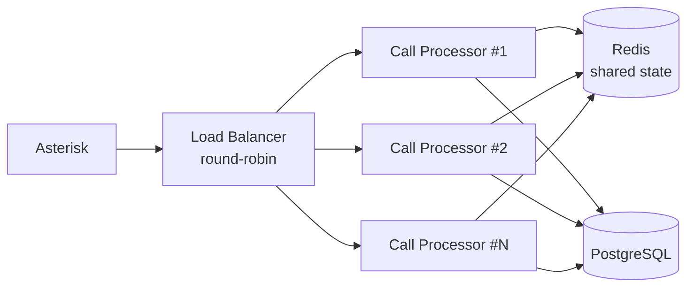

# Нефункциональные требования (NFR)

## 1. Производительность

### 1.1 Задержки (latency)

| Метрика | Требование | Описание |
|---------|------------|----------|
| Время ответа (end-to-end) | **< 2 сек** (p95) | От конца речи клиента до начала голосового ответа бота |
| STT задержка | < 500 мс | От конца фразы до получения final transcript |
| LLM задержка | < 1000 мс | Время до первого токена ответа (TTFT) |
| TTS задержка | < 500 мс | От текста до первого байта аудио |
| Tool call (Store API) | < 300 мс (p95) | Время ответа API магазина |

### 1.2 Пропускная способность

| Метрика | Требование |
|---------|------------|
| Одновременные звонки | **50** (MVP), **200** (продакшен) |
| Звонков в день | 200–500 (начальный), до 2000 (рост) |
| Пиковая нагрузка | 3x от средней (сезон, акции) |

### 1.3 Метрики аудио

| Метрика | Требование |
|---------|------------|
| Формат аудио | 16kHz, 16-bit, signed linear PCM |
| Размер аудио-фрейма | 20 мс (640 байт) |
| Джиттер AudioSocket | < 30 мс |

## 2. Доступность

| Метрика | Требование | Описание |
|---------|------------|----------|
| Uptime | **99.5%** | ~3.6 часа простоя в месяц |
| Запланированное обслуживание | Ночь (00:00–06:00) | Минимальный трафик |
| RTO (Recovery Time Objective) | **< 15 мин** | Время восстановления после сбоя |
| RPO (Recovery Point Objective) | **< 1 час** | Максимальная потеря данных |

### 2.1 Graceful degradation

При сбое компонента система НЕ обрывает звонок, а переключает на оператора:

| Сбой | Поведение |
|------|-----------|
| Google STT недоступен | Сообщение клиенту → переключение на оператора |
| Claude API недоступен | 1 retry → переключение на оператора |
| Google TTS недоступен | Пре-записанное сообщение → переключение на оператора |
| Store API недоступен | Агент сообщает о временных проблемах, предлагает перезвонить |
| PostgreSQL недоступен | Звонки продолжают работать, логирование в Redis (буфер) |
| Redis недоступен | Звонки работают (in-memory state), без кэширования |

## 3. Масштабируемость

### 3.1 Горизонтальное масштабирование

- Call Processor — stateless (состояние в Redis)
- Добавление инстансов без простоя
- Asterisk распределяет AudioSocket-соединения по round-robin

### 3.2 Вертикальное масштабирование

| Ресурс | Формула | Пример (50 звонков) |
|--------|---------|---------------------|
| CPU | ~0.1 core / звонок | 5 cores |
| RAM | ~50 MB / сессия | 2.5 GB |
| Сеть | ~32 kbps / звонок (STT upload) | 1.6 Mbps |

## 4. Безопасность

### 4.1 Аутентификация и авторизация

| Компонент | Механизм |
|-----------|----------|
| Store API | Bearer token (API key) |
| Asterisk ARI | Basic Auth (HTTPS) |
| Google Cloud | Service Account (JSON key) |
| Claude API | API key (env variable) |
| Grafana | Login + password |
| Admin API | JWT tokens |

### 4.2 Защита данных

| Требование | Реализация |
|------------|------------|
| API-ключи | Env variables / docker secrets; ротация каждые 90 дней ([подробнее](../security/threat-model.md#управление-api-ключами-и-секретами)) |
| Передача данных | HTTPS для всех внешних API |
| AudioSocket | Только LAN (127.0.0.1 или private network) |
| PII (персональные данные) | Номер телефона — хэширование в логах |
| Запись звонков | Аудио НЕ сохраняется (только транскрипции) |
| Доступ к БД | Только из Docker network |

### 4.3 Соответствие законодательству Украины

| Требование | Реализация |
|------------|------------|
| Закон "Про захист персональних даних" | Минимизация PII, согласие на обработку |
| Уведомление о записи | Бот сообщает что звонок может записываться |
| Право на удаление | API для удаления данных клиента |
| Хранение данных | Серверы НЕ в РФ (UA или EU) |

## 5. Надёжность

### 5.1 Обработка ошибок

- Все внешние вызовы обёрнуты в try/except с логированием
- Retry с exponential backoff для transient ошибок (сеть, 503)
- Circuit breaker для Store API (если 5+ ошибок за 30 сек → fallback)
- Каждый звонок изолирован — ошибка в одном не влияет на другие

### 5.2 Мониторинг

| Что мониторим | Инструмент | Алерт при |
|---------------|------------|-----------|
| Количество активных звонков | Prometheus gauge | — |
| Задержки (STT, LLM, TTS) | Prometheus histogram | p95 > 3 сек |
| Ошибки | Prometheus counter | >5 за 10 мин |
| % переключений на оператора | Prometheus gauge | >50% за 1 час |
| CPU/RAM/Disk | node_exporter | CPU >80%, RAM >85%, Disk >90% |
| Asterisk каналы | AMI exporter | Нет свободных каналов |

## 6. Сопровождаемость

### 6.1 Логирование

| Уровень | Что логируем |
|---------|-------------|
| INFO | Начало/конец звонка, сценарий, результат |
| DEBUG | Каждый turn (STT текст, LLM ответ, tool calls) |
| WARNING | Retry, таймауты, низкая уверенность STT |
| ERROR | Ошибки API, необработанные исключения |

**Формат:** structured JSON logs (для парсинга в ELK/Loki).

### 6.2 Конфигурация

- Все параметры — через environment variables
- Дефолты для development — в `.env.example`
- Промпты — в БД (версионирование, A/B тесты)
- Без хардкода URL, ключей, пороговых значений

### 6.3 Тестирование

| Тип | Покрытие | Инструмент | Детали |
|-----|----------|------------|--------|
| Unit-тесты | Агент, tools, парсинг AudioSocket | pytest | Min 80% покрытие core-модулей |
| Интеграционные | Pipeline (mock STT/TTS), Store API | pytest + testcontainers | PostgreSQL, Redis в контейнерах |
| E2E | Полный звонок через тестовый SIP | SIPp + custom scripts | Все ключевые сценарии |
| Нагрузочные | 50/100/200 одновременных звонков | Locust + SIPp | p95 < 2 сек, 0% потерь при 50 звонках |

Подробная стратегия тестирования: [development/00-overview.md](../development/00-overview.md#стратегия-тестирования)

### 6.4 CI/CD

Автоматический pipeline при каждом push/PR:

1. **Lint & Type Check** — ruff, mypy (strict)
2. **Unit Tests** — pytest с покрытием
3. **Security Scan** — pip-audit, safety
4. **Integration Tests** — с PostgreSQL и Redis в testcontainers
5. **Build** — Docker image
6. **Deploy** — staging (auto), production (manual approval)

Подробная конфигурация: [development/00-overview.md](../development/00-overview.md#cicd-pipeline)

## 7. Совместимость

| Требование | Значение |
|------------|----------|
| Python | 3.12+ |
| Asterisk | 18+ (AudioSocket), рекомендуется 20 |
| PostgreSQL | 15+ (с pgvector 0.5+) |
| Redis | 7+ |
| Docker | 24+ |
| Docker Compose | v2+ |
| ОС | Ubuntu 22.04 LTS / Debian 12 |
