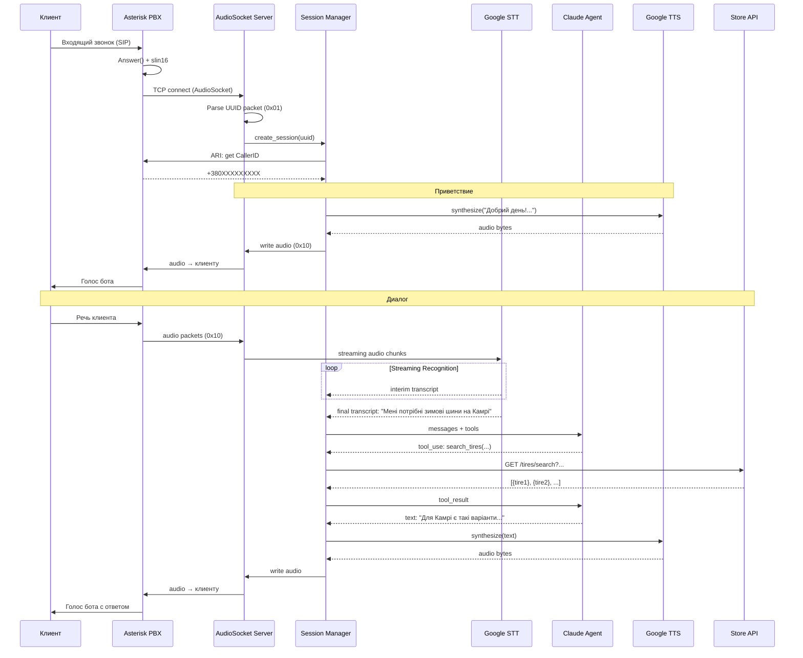
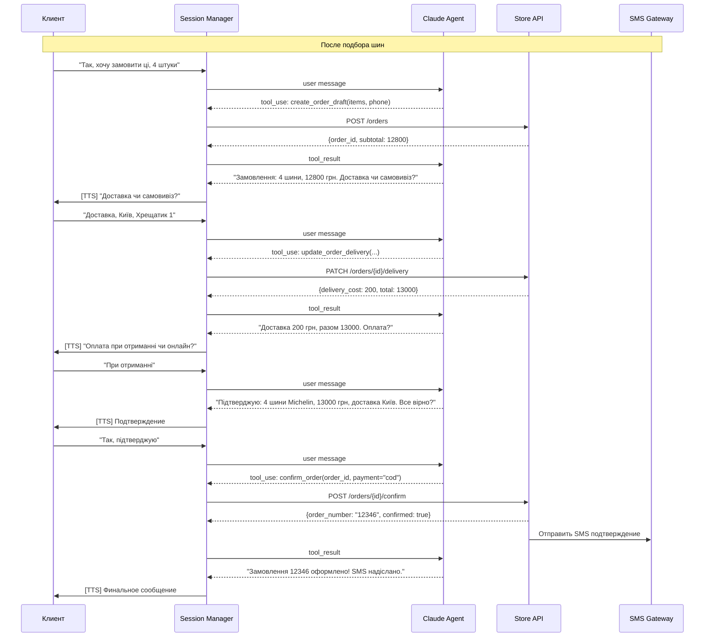
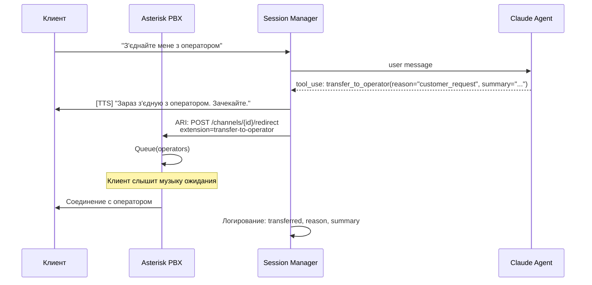
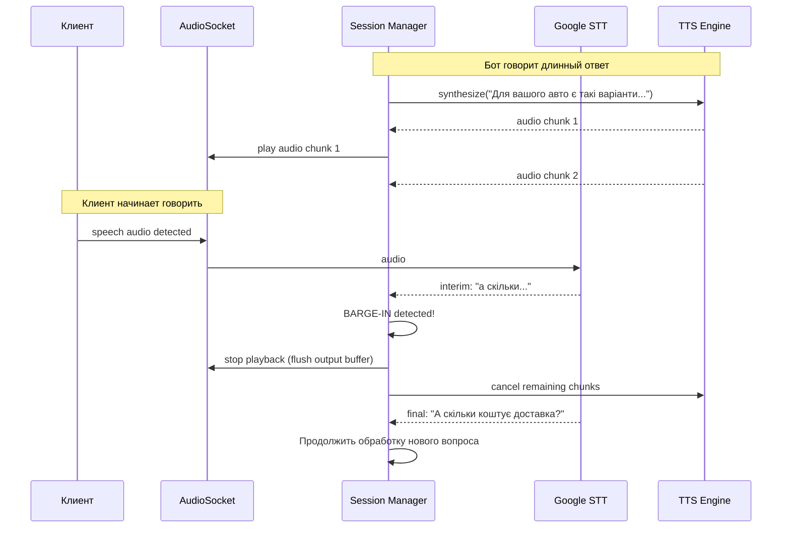
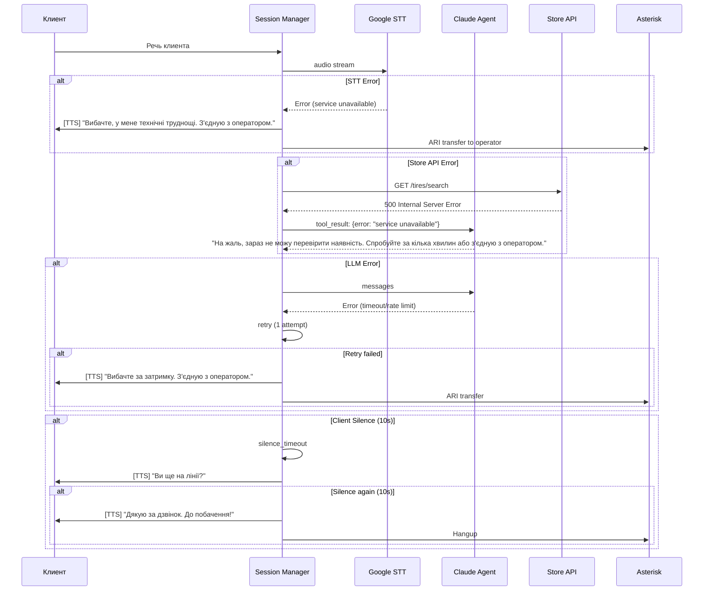
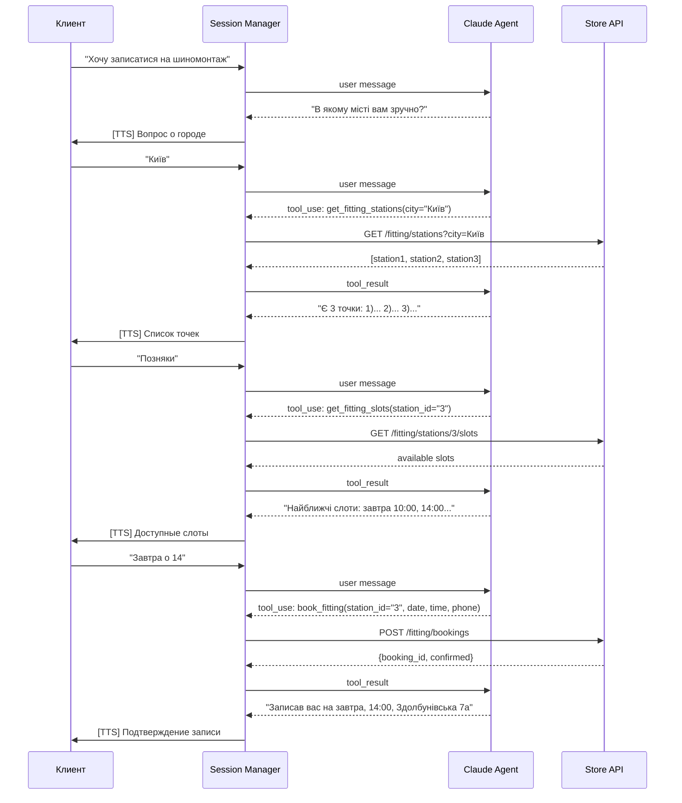

# Диаграммы последовательности

## 1. Основной поток: входящий звонок

## 2. Оформление заказа

## 3. Переключение на оператора

## 4. Barge-in (клиент перебивает бота)

## 5. Обработка ошибок

## 6. Запись на шиномонтаж

